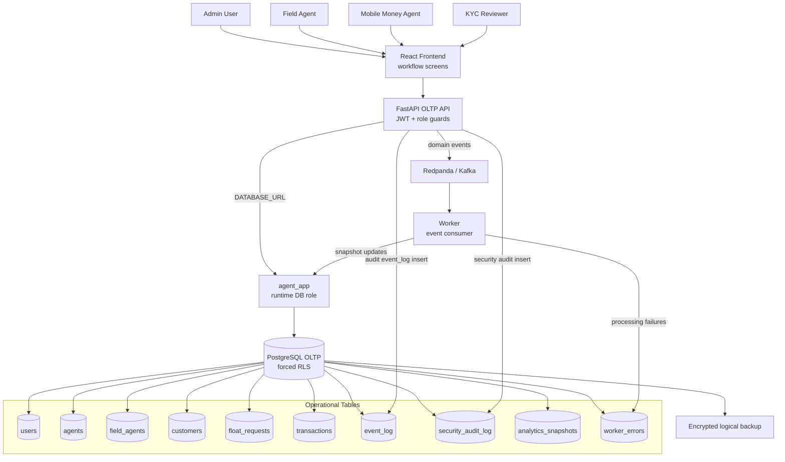
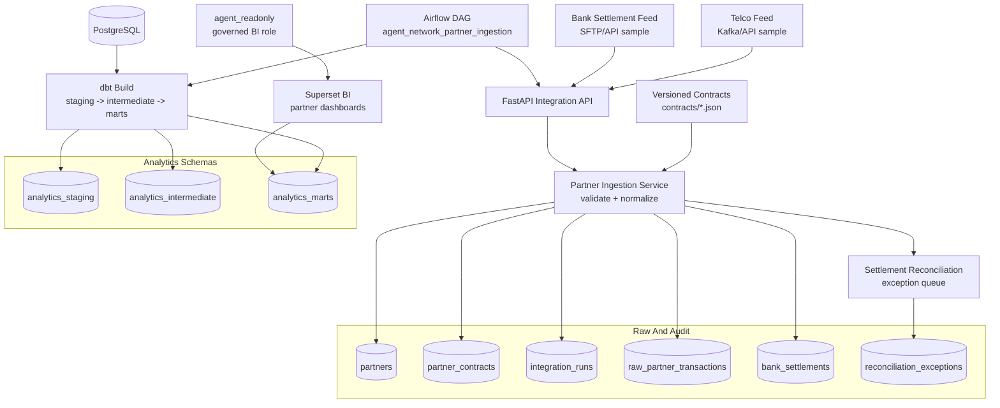
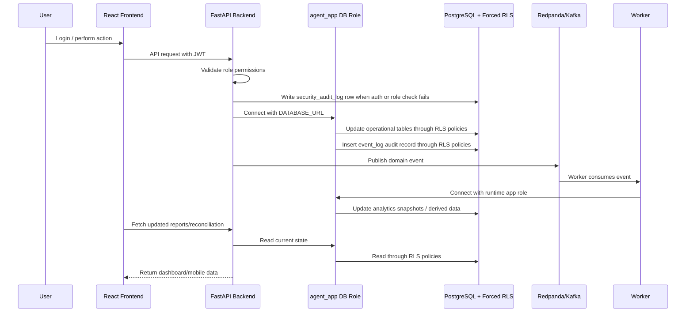
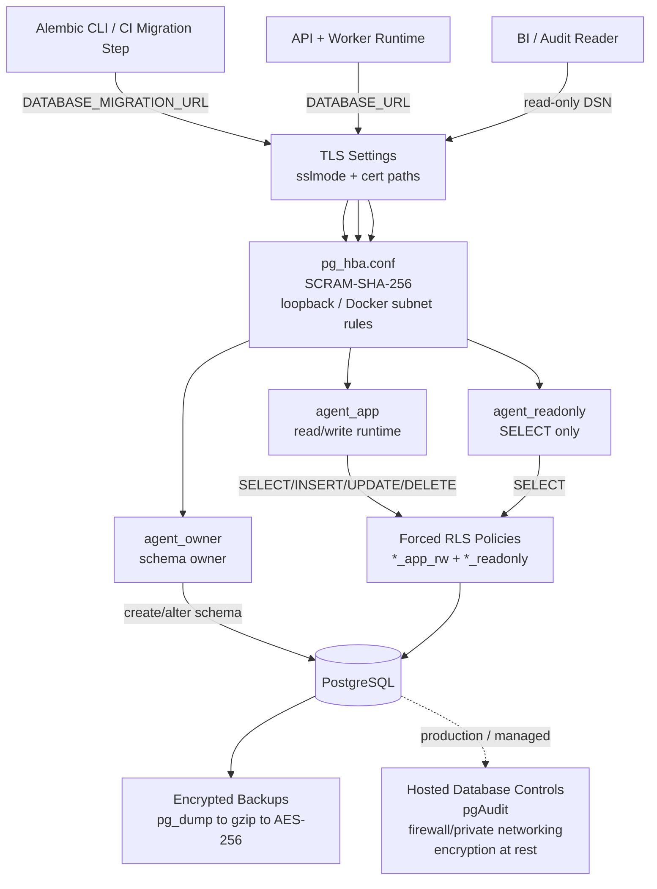
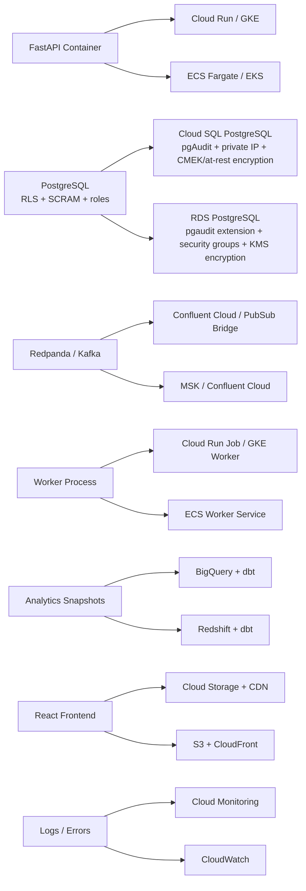

# Architecture

The platform is now a local production-shaped stack instead of an in-memory prototype.

## Database Diagram

The relational schema is published on dbdiagram.io:

https://dbdiagram.io/d/mnt-c-Users-Hp-agent-network-infra-sim-6a148481dfb20dafcdeb52fe

The source DBML for the diagram lives in [`docs/schema.dbml`](schema.dbml). It now includes the database security posture for every application table:

- forced Row-Level Security
- app read/write policy
- read-only select policy
- owner/app/read-only role effects
- migration-only ownership through `DATABASE_MIGRATION_URL`

## Workflow Linkage

The operational tables, audit tables, worker tables, and reporting tables are intentionally linked so the workflow can be traced end to end:

- `transactions.customer_id` links customer activity to KYC/customer records while keeping `customer_phone` as the operational lookup value.
- `event_log.aggregate_type` and `event_log.aggregate_id` identify the domain aggregate for every event.
- `event_log.agent_id`, `event_log.customer_id`, `event_log.float_request_id`, and `event_log.transaction_id` provide direct relational links for common event queries.
- `security_audit_log.user_id` links blocked access attempts back to the user account when the caller is known.
- `worker_errors.event_id` links failed consumer processing back to the event that failed.
- `analytics_snapshots.scope`, `agent_id`, and `field_agent_id` support network-wide, agent-level, and field-agent-level reporting.
- `partners`, `partner_contracts`, and `integration_runs` document external telco/bank feeds, expected schema, data freshness SLA, source reference, load status, and rejection counts.
- `raw_partner_transactions` stores normalized telco transaction records with hashed customer identifiers and immutable raw payloads for replay/reconciliation.
- `bank_settlements` and `reconciliation_exceptions` model bank/telco settlement matching and the exception queue that data/ops teams must clear.

Customer-facing and reporting outputs mask customer PII at the API boundary. The database keeps the source values for regulated operations, while API responses from customer, transaction, report, and event-audit endpoints mask customer names, phone numbers, national IDs, birthdays, and addresses.

## Performance Indexes

The schema includes indexes for the expected high-volume filters:

- Auth and user management: `users.email`, `users.role`, `users.agent_id`, `users.role + is_active`.
- Field operations: `agents.field_agent_id`, `agents.field_agent_id + name`, `agents.latitude + longitude`.
- KYC queues: `customers.phone`, `customers.compliance_status + verified_at`, `customers.name + surname`.
- Float workflows: `float_requests.agent_id`, `float_requests.status`, `float_requests.status + requested_at`, `float_requests.agent_id + status`.
- Transaction history and reports: `transactions.agent_id + created_at`, `transactions.customer_id + created_at`, `transactions.transaction_type + created_at`, `transactions.customer_phone + created_at`.
- Event audit: `event_log.topic + created_at`, `event_log.name + created_at`, `event_log.aggregate_type + aggregate_id`, plus entity FK indexes.
- Security audit: `security_audit_log.event_type + created_at`, `security_audit_log.outcome + created_at`, and `security_audit_log.user_id + created_at`.
- Analytics: `analytics_snapshots.scope + snapshot_date`, `analytics_snapshots.agent_id + snapshot_date`, `analytics_snapshots.field_agent_id + snapshot_date`.
- Worker failures: `worker_errors.source + created_at`.
- Partner metadata: `partners.partner_type + country`, active contract lookup, and integration mode.
- Integration observability: `integration_runs.partner_id + started_at`, `integration_runs.status + started_at`, and unique partner/feed/source references.
- Telco raw feeds: unique partner/provider references plus partner/date and agent/date access paths.
- Bank settlements: unique partner/settlement references and partner/date reporting.
- Reconciliation exceptions: partner/status and exception type/created date filters.

Use Postgres `jsonb` plus GIN indexes for `event_log.payload` and `analytics_snapshots.metrics` only when production queries need to search inside those JSON documents frequently.

## Runtime Components

- React/Vite frontend for admin, reporting, KYC, field map, event audit, and mobile-agent workflows.
- FastAPI API service with JWT role-based auth.
- Security audit middleware and admin-only audit endpoint for failed login, unauthorized, and forbidden attempts.
- PostgreSQL operational database.
- Redpanda Kafka-compatible broker for domain events.
- Worker process for analytics materialization and future stream consumers.
- Named Kafka monitor consumers for analytics, fraud, liquidity, and reconciliation visibility in Redpanda Console.
- Alembic migrations for schema changes.
- Partner feed contracts and ingestion audit tables for telco/bank integration simulation.
- Reconciliation exception workflow for settlement mismatches.
- dbt analytics project for staging, intermediate, fact, dimension, and mart models.
- Optional Airflow service for ingestion/reconciliation/dbt orchestration.
- Optional Superset service for governed dashboards and partner-facing RLS.
- Database security controls: owner/app/read-only PostgreSQL roles, SCRAM-SHA-256 authentication, `pg_hba.conf` network rules, forced RLS policies, encrypted logical backups, and hosted pgAudit/encryption-at-rest requirements.
- SPOF controls: documented SPOF register, encrypted backup creation, and restore drill into a temporary PostgreSQL database.

## Data Flow

1. A user logs in and receives a JWT.
2. Frontend calls protected `/api/v1` routes.
3. FastAPI validates JWT and role access; failed login, unauthorized, and forbidden attempts are written to `security_audit_log`.
4. Authorized requests update PostgreSQL and publish domain events.
5. Each event is also stored in `event_log` for business auditability.
6. Redpanda carries the stream for worker consumers.
7. Worker materializes analytics snapshots for dashboard/reporting workflows.
8. Partner feeds are validated against versioned contracts, loaded into raw integration tables, and reconciled against settlement totals.
9. Airflow orchestrates partner ingestion, reconciliation, and dbt builds when the `orchestration` profile is enabled.
10. dbt transforms operational/integration tables into governed analytics marts.
11. Superset connects to mart schemas for internal dashboards and partner-scoped reporting.

## Full Architecture Diagram

```mermaid
flowchart TB
    user_admin[Admin / Ops User]
    user_field[Field Agent]
    user_agent[Mobile Agent]
    user_kyc[KYC Reviewer]
    telco_partner[Telco Partner Feed<br/>Kafka/API]
    bank_partner[Bank Partner Feed<br/>SFTP Settlement]

    frontend[React / Vite Frontend<br/>http://127.0.0.1:5173]
    api[FastAPI Backend<br/>/api/v1<br/>JWT Auth + Role Guards]
    auth[Auth Module<br/>JWT + bcrypt<br/>Roles: admin, field_agent, agent, kyc_reviewer]
    security_audit[Security Audit<br/>failed login + 401/403 capture]
    migration[Alembic Migrations<br/>DATABASE_MIGRATION_URL<br/>owner role only]
    db_security[DB Security Boundary<br/>SCRAM + pg_hba.conf<br/>TLS config + loopback bind]
    postgres[(PostgreSQL<br/>Operational DB<br/>Forced RLS)]
    app_role[agent_app role<br/>runtime read/write]
    owner_role[agent_owner role<br/>schema owner]
    readonly_role[agent_readonly role<br/>SELECT only]
    backup[Encrypted Backup<br/>pg_dump + gzip + AES-256]
    managed_controls[Hosted Controls<br/>pgAudit + firewall/private network<br/>encryption at rest]
    redpanda[Redpanda<br/>Kafka-compatible Broker]
    worker[Background Worker<br/>Event Consumer + Analytics Jobs]
    analytics_monitor[analytics-worker<br/>transaction + commission + float topics]
    fraud_monitor[fraud-monitor<br/>transaction + KYC topics]
    liquidity_monitor[liquidity-monitor<br/>float + transaction topics]
    reconciliation_monitor[reconciliation-monitor<br/>transaction + commission topics]
    contracts[Partner Contracts<br/>contracts/*.json]
    ingestion[Partner Ingestion Service<br/>validation + run audit]
    reconciliation_flow[Settlement Reconciliation<br/>exception queue]
    airflow[Airflow<br/>http://127.0.0.1:18080]
    dbt[dbt Project<br/>staging + marts]
    superset[Superset BI<br/>http://127.0.0.1:18088]
    marts[(dbt Analytics Schemas<br/>analytics_staging<br/>analytics_intermediate<br/>analytics_marts)]
    console[Redpanda Console<br/>http://127.0.0.1:18081]
    docs[API Docs<br/>/docs]

    subgraph Frontend Views
        login[Login]
        float_ui[Float Control + Reconciliation]
        reports_ui[Reports Dashboard]
        kyc_ui[KYC Review]
        map_ui[Field Team Map]
        mobile_ui[Agent Mobile Interface]
        events_ui[Event Audit Log]
        security_ui[Security Audit Review]
    end

    subgraph API Modules
        agents_api[Agents API]
        field_api[Field Agents API]
        customers_api[Customers API]
        kyc_api[KYC Review API]
        float_api[Float Requests API]
        tx_api[Transactions API]
        reports_api[Reports API]
        map_api[Map API]
        events_api[Events API]
        security_api[Security Audit API]
    end

    subgraph PostgreSQL Tables
        users_tbl[(users<br/>RLS forced)]
        agents_tbl[(agents<br/>RLS forced)]
        field_agents_tbl[(field_agents<br/>RLS forced)]
        customers_tbl[(customers<br/>RLS forced)]
        float_tbl[(float_requests<br/>RLS forced)]
        tx_tbl[(transactions<br/>RLS forced)]
        event_tbl[(event_log<br/>RLS forced)]
        security_audit_tbl[(security_audit_log<br/>RLS forced)]
        analytics_tbl[(analytics_snapshots<br/>RLS forced)]
        worker_errors_tbl[(worker_errors<br/>RLS forced)]
        partners_tbl[(partners<br/>RLS forced)]
        contracts_tbl[(partner_contracts<br/>RLS forced)]
        runs_tbl[(integration_runs<br/>RLS forced)]
        raw_partner_tx_tbl[(raw_partner_transactions<br/>RLS forced)]
        settlements_tbl[(bank_settlements<br/>RLS forced)]
        recon_tbl[(reconciliation_exceptions<br/>RLS forced)]
    end

    subgraph Kafka Topics
        float_events[float-events]
        tx_events[transaction-events]
        kyc_events[kyc-events]
        location_events[agent-location-events]
        commission_events[commission-events]
    end

    user_admin --> frontend
    user_field --> frontend
    user_agent --> frontend
    user_kyc --> frontend
    telco_partner --> redpanda
    telco_partner --> ingestion
    bank_partner --> ingestion
    contracts --> ingestion

    frontend --> login
    frontend --> float_ui
    frontend --> reports_ui
    frontend --> kyc_ui
    frontend --> map_ui
    frontend --> mobile_ui
    frontend --> events_ui
    frontend --> security_ui
    frontend --> api
    docs --> api

    api --> auth
    migration -->|schema changes only| owner_role
    owner_role --> db_security
    api -->|DATABASE_URL| app_role
    worker -->|DATABASE_URL| app_role
    reports_ui -.->|BI / audit reads| readonly_role
    app_role --> db_security
    readonly_role --> db_security
    db_security --> postgres
    postgres --> backup
    postgres -. hosted deployments .-> managed_controls
    api --> agents_api
    api --> field_api
    api --> customers_api
    api --> kyc_api
    api --> float_api
    api --> tx_api
    api --> reports_api
    api --> map_api
    api --> events_api
    api --> security_api
    api --> ingestion
    ingestion --> reconciliation_flow
    airflow --> ingestion
    airflow --> dbt

    auth --> users_tbl
    auth --> security_audit
    security_audit --> security_audit_tbl
    agents_api --> app_role
    field_api --> app_role
    customers_api --> app_role
    kyc_api --> app_role
    float_api --> app_role
    tx_api --> app_role
    reports_api --> app_role
    map_api --> app_role
    events_api --> app_role
    security_api --> app_role

    postgres --> users_tbl
    postgres --> agents_tbl
    postgres --> field_agents_tbl
    postgres --> customers_tbl
    postgres --> float_tbl
    postgres --> tx_tbl
    postgres --> event_tbl
    postgres --> security_audit_tbl
    postgres --> analytics_tbl
    postgres --> worker_errors_tbl
    postgres --> partners_tbl
    postgres --> contracts_tbl
    postgres --> runs_tbl
    postgres --> raw_partner_tx_tbl
    postgres --> settlements_tbl
    postgres --> recon_tbl
    postgres --> marts

    tx_tbl -->|customer_id| customers_tbl
    event_tbl -->|agent_id| agents_tbl
    event_tbl -->|customer_id| customers_tbl
    event_tbl -->|float_request_id| float_tbl
    event_tbl -->|transaction_id| tx_tbl
    security_audit_tbl -->|user_id| users_tbl
    worker_errors_tbl -->|event_id| event_tbl
    analytics_tbl -->|agent_id| agents_tbl
    analytics_tbl -->|field_agent_id| field_agents_tbl
    contracts_tbl -->|partner_id| partners_tbl
    runs_tbl -->|partner_id| partners_tbl
    runs_tbl -->|contract_id| contracts_tbl
    raw_partner_tx_tbl -->|partner_id| partners_tbl
    raw_partner_tx_tbl -->|integration_run_id| runs_tbl
    raw_partner_tx_tbl -->|agent_id| agents_tbl
    settlements_tbl -->|partner_id| partners_tbl
    settlements_tbl -->|integration_run_id| runs_tbl
    recon_tbl -->|partner_id| partners_tbl
    recon_tbl -->|integration_run_id| runs_tbl

    float_api -->|float.requested / approved / rejected / disbursed| redpanda
    tx_api -->|transaction.created| redpanda
    tx_api -->|commission.calculated| redpanda
    kyc_api -->|customer.kyc_reviewed| redpanda
    map_api -->|agent.location_updated| redpanda

    redpanda --> float_events
    redpanda --> tx_events
    redpanda --> kyc_events
    redpanda --> location_events
    redpanda --> commission_events

    api -->|also persists every event| event_tbl
    api -->|blocked auth/access attempts| security_audit_tbl
    ingestion --> partners_tbl
    ingestion --> contracts_tbl
    ingestion --> runs_tbl
    ingestion --> raw_partner_tx_tbl
    ingestion --> settlements_tbl
    reconciliation_flow --> recon_tbl
    dbt --> marts
    superset --> marts
    superset -. partner RLS .-> readonly_role
    redpanda --> worker
    redpanda --> analytics_monitor
    redpanda --> fraud_monitor
    redpanda --> liquidity_monitor
    redpanda --> reconciliation_monitor
    worker --> analytics_tbl
    worker --> worker_errors_tbl
    console --> redpanda
```

## OLTP Architecture Diagram

This view isolates the operational transaction-processing side: users, frontend workflows, FastAPI role checks, the runtime PostgreSQL role, forced RLS tables, Redpanda events, and the worker that keeps operational analytics snapshots current.

## Reporting Architecture Diagram

This view isolates the reporting side: partner/telco/bank feeds, contract validation, integration audit tables, reconciliation, Airflow orchestration, dbt transformations, governed analytics schemas, and Superset dashboards.

## Request Data Flow

## Database Security Flow

Summary:

- Alembic migrations use `DATABASE_MIGRATION_URL` and the `agent_owner` role so schema changes are separated from runtime traffic.
- The API and worker use `DATABASE_URL` and the `agent_app` role, which is limited to table-level read/write grants and must pass through forced RLS policies.
- Reporting and audit clients should use `agent_readonly`, which receives SELECT-only access through read-only RLS policies.
- Local Docker access is constrained by SCRAM-SHA-256 authentication, `pg_hba.conf`, TLS connection settings, and loopback-bound database ports.
- Logical backups are encrypted before being written to disk; pgAudit, firewall/private networking, and encryption at rest remain provider-level controls for hosted PostgreSQL.

## Security Effects On Schema State

| State | Effect |
| --- | --- |
| Existing local schema before hardening | Tables/data remain in place. The local volume may need one-time role bootstrap and object ownership transfer before applying `0002_postgres_security`. |
| Fresh schema after hardening | Roles are created during Postgres initialization. Tables are created by the owner role through `DATABASE_MIGRATION_URL`. |
| After `0002_postgres_security` | All application tables have forced RLS, app read/write policies, read-only select policies, app/read-only grants, and public schema creation revoked. |
| Future schema changes | New tables must receive forced RLS and role-specific policies before production traffic uses them. Runtime code should continue using the app role only. |

## Production Mapping

| Local | GCP | AWS |
| --- | --- | --- |
| FastAPI container | Cloud Run or GKE | ECS Fargate or EKS |
| PostgreSQL | Cloud SQL | RDS PostgreSQL |
| Redpanda/Kafka | Confluent Cloud or Pub/Sub bridge | MSK or Confluent Cloud |
| Worker | Cloud Run jobs or GKE worker | ECS worker service |
| Analytics snapshots | BigQuery/dbt | Redshift/dbt |
| React app | Cloud Storage + CDN | S3 + CloudFront |
| Logs/metrics | Cloud Monitoring | CloudWatch |

## Event Topics

- `float-events`
- `transaction-events`
- `kyc-events`
- `agent-location-events`
- `commission-events`

## Event Names

- `float.requested`
- `float.approved`
- `float.rejected`
- `float.disbursed`
- `cash.collected`
- `cash.deposited`
- `customer.kyc_submitted`
- `customer.kyc_reviewed`
- `transaction.created`
- `commission.calculated`
- `agent.location_updated`
