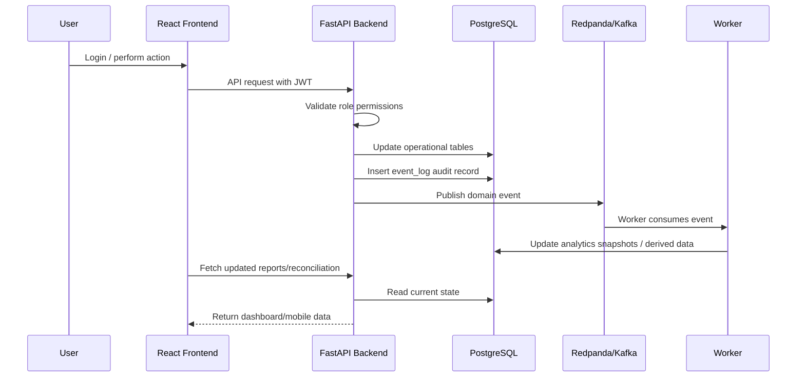
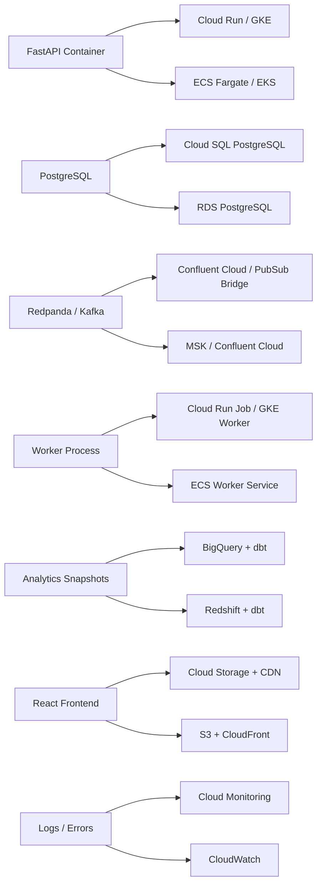

# Architecture

The platform is now a local production-shaped stack instead of an in-memory prototype.

## Database Diagram

The relational schema is published on dbdiagram.io:

https://dbdiagram.io/d/mnt-c-Users-Hp-agent-network-infra-sim-6a148481dfb20dafcdeb52fe

## Workflow Linkage

The operational tables, audit tables, worker tables, and reporting tables are intentionally linked so the workflow can be traced end to end:

- `transactions.customer_id` links customer activity to KYC/customer records while keeping `customer_phone` as the operational lookup value.
- `event_log.aggregate_type` and `event_log.aggregate_id` identify the domain aggregate for every event.
- `event_log.agent_id`, `event_log.customer_id`, `event_log.float_request_id`, and `event_log.transaction_id` provide direct relational links for common event queries.
- `worker_errors.event_id` links failed consumer processing back to the event that failed.
- `analytics_snapshots.scope`, `agent_id`, and `field_agent_id` support network-wide, agent-level, and field-agent-level reporting.

Customer-facing and reporting outputs mask customer PII at the API boundary. The database keeps the source values for regulated operations, while API responses from customer, transaction, report, and event-audit endpoints mask customer names, phone numbers, national IDs, birthdays, and addresses.

## Performance Indexes

The schema includes indexes for the expected high-volume filters:

- Auth and user management: `users.email`, `users.role`, `users.agent_id`, `users.role + is_active`.
- Field operations: `agents.field_agent_id`, `agents.field_agent_id + name`, `agents.latitude + longitude`.
- KYC queues: `customers.phone`, `customers.compliance_status + verified_at`, `customers.name + surname`.
- Float workflows: `float_requests.agent_id`, `float_requests.status`, `float_requests.status + requested_at`, `float_requests.agent_id + status`.
- Transaction history and reports: `transactions.agent_id + created_at`, `transactions.customer_id + created_at`, `transactions.transaction_type + created_at`, `transactions.customer_phone + created_at`.
- Event audit: `event_log.topic + created_at`, `event_log.name + created_at`, `event_log.aggregate_type + aggregate_id`, plus entity FK indexes.
- Analytics: `analytics_snapshots.scope + snapshot_date`, `analytics_snapshots.agent_id + snapshot_date`, `analytics_snapshots.field_agent_id + snapshot_date`.
- Worker failures: `worker_errors.source + created_at`.

Use Postgres `jsonb` plus GIN indexes for `event_log.payload` and `analytics_snapshots.metrics` only when production queries need to search inside those JSON documents frequently.

## Runtime Components

- React/Vite frontend for admin, reporting, KYC, field map, event audit, and mobile-agent workflows.
- FastAPI API service with JWT role-based auth.
- PostgreSQL operational database.
- Redpanda Kafka-compatible broker for domain events.
- Worker process for analytics materialization and future stream consumers.
- Alembic migrations for schema changes.

## Data Flow

1. A user logs in and receives a JWT.
2. Frontend calls protected `/api/v1` routes.
3. FastAPI validates role access, updates PostgreSQL, and publishes a domain event.
4. Each event is also stored in `event_log` for auditability.
5. Redpanda carries the stream for worker consumers.
6. Worker materializes analytics snapshots for dashboard/reporting workflows.

## Full Architecture Diagram

```mermaid
flowchart TB
    user_admin[Admin / Ops User]
    user_field[Field Agent]
    user_agent[Mobile Agent]
    user_kyc[KYC Reviewer]

    frontend[React / Vite Frontend<br/>http://127.0.0.1:5173]
    api[FastAPI Backend<br/>/api/v1<br/>JWT Auth + Role Guards]
    auth[Auth Module<br/>JWT + bcrypt<br/>Roles: admin, field_agent, agent, kyc_reviewer]
    postgres[(PostgreSQL<br/>Operational DB)]
    redpanda[Redpanda<br/>Kafka-compatible Broker]
    worker[Background Worker<br/>Event Consumer + Analytics Jobs]
    console[Redpanda Console<br/>http://127.0.0.1:8080]
    docs[API Docs<br/>/docs]

    subgraph Frontend Views
        login[Login]
        float_ui[Float Control + Reconciliation]
        reports_ui[Reports Dashboard]
        kyc_ui[KYC Review]
        map_ui[Field Team Map]
        mobile_ui[Agent Mobile Interface]
        events_ui[Event Audit Log]
    end

    subgraph API Modules
        agents_api[Agents API]
        field_api[Field Agents API]
        customers_api[Customers API]
        kyc_api[KYC Review API]
        float_api[Float Requests API]
        tx_api[Transactions API]
        reports_api[Reports API]
        map_api[Map API]
        events_api[Events API]
    end

    subgraph PostgreSQL Tables
        users_tbl[(users)]
        agents_tbl[(agents)]
        field_agents_tbl[(field_agents)]
        customers_tbl[(customers)]
        float_tbl[(float_requests)]
        tx_tbl[(transactions)]
        event_tbl[(event_log)]
        analytics_tbl[(analytics_snapshots)]
        worker_errors_tbl[(worker_errors)]
    end

    subgraph Kafka Topics
        float_events[float-events]
        tx_events[transaction-events]
        kyc_events[kyc-events]
        location_events[agent-location-events]
        commission_events[commission-events]
    end

    user_admin --> frontend
    user_field --> frontend
    user_agent --> frontend
    user_kyc --> frontend

    frontend --> login
    frontend --> float_ui
    frontend --> reports_ui
    frontend --> kyc_ui
    frontend --> map_ui
    frontend --> mobile_ui
    frontend --> events_ui
    frontend --> api
    docs --> api

    api --> auth
    api --> agents_api
    api --> field_api
    api --> customers_api
    api --> kyc_api
    api --> float_api
    api --> tx_api
    api --> reports_api
    api --> map_api
    api --> events_api

    auth --> users_tbl
    agents_api --> postgres
    field_api --> postgres
    customers_api --> postgres
    kyc_api --> postgres
    float_api --> postgres
    tx_api --> postgres
    reports_api --> postgres
    map_api --> postgres
    events_api --> postgres

    postgres --> users_tbl
    postgres --> agents_tbl
    postgres --> field_agents_tbl
    postgres --> customers_tbl
    postgres --> float_tbl
    postgres --> tx_tbl
    postgres --> event_tbl
    postgres --> analytics_tbl
    postgres --> worker_errors_tbl

    tx_tbl -->|customer_id| customers_tbl
    event_tbl -->|agent_id| agents_tbl
    event_tbl -->|customer_id| customers_tbl
    event_tbl -->|float_request_id| float_tbl
    event_tbl -->|transaction_id| tx_tbl
    worker_errors_tbl -->|event_id| event_tbl
    analytics_tbl -->|agent_id| agents_tbl
    analytics_tbl -->|field_agent_id| field_agents_tbl

    float_api -->|float.requested / approved / rejected / disbursed| redpanda
    tx_api -->|transaction.created| redpanda
    tx_api -->|commission.calculated| redpanda
    kyc_api -->|customer.kyc_reviewed| redpanda
    map_api -->|agent.location_updated| redpanda

    redpanda --> float_events
    redpanda --> tx_events
    redpanda --> kyc_events
    redpanda --> location_events
    redpanda --> commission_events

    api -->|also persists every event| event_tbl
    redpanda --> worker
    worker --> analytics_tbl
    worker --> worker_errors_tbl
    worker --> postgres
    console --> redpanda
```

## Request Data Flow

## Production Mapping

| Local | GCP | AWS |
| --- | --- | --- |
| FastAPI container | Cloud Run or GKE | ECS Fargate or EKS |
| PostgreSQL | Cloud SQL | RDS PostgreSQL |
| Redpanda/Kafka | Confluent Cloud or Pub/Sub bridge | MSK or Confluent Cloud |
| Worker | Cloud Run jobs or GKE worker | ECS worker service |
| Analytics snapshots | BigQuery/dbt | Redshift/dbt |
| React app | Cloud Storage + CDN | S3 + CloudFront |
| Logs/metrics | Cloud Monitoring | CloudWatch |

## Event Topics

- `float-events`
- `transaction-events`
- `kyc-events`
- `agent-location-events`
- `commission-events`

## Event Names

- `float.requested`
- `float.approved`
- `float.rejected`
- `float.disbursed`
- `cash.collected`
- `cash.deposited`
- `customer.kyc_submitted`
- `customer.kyc_reviewed`
- `transaction.created`
- `commission.calculated`
- `agent.location_updated`
