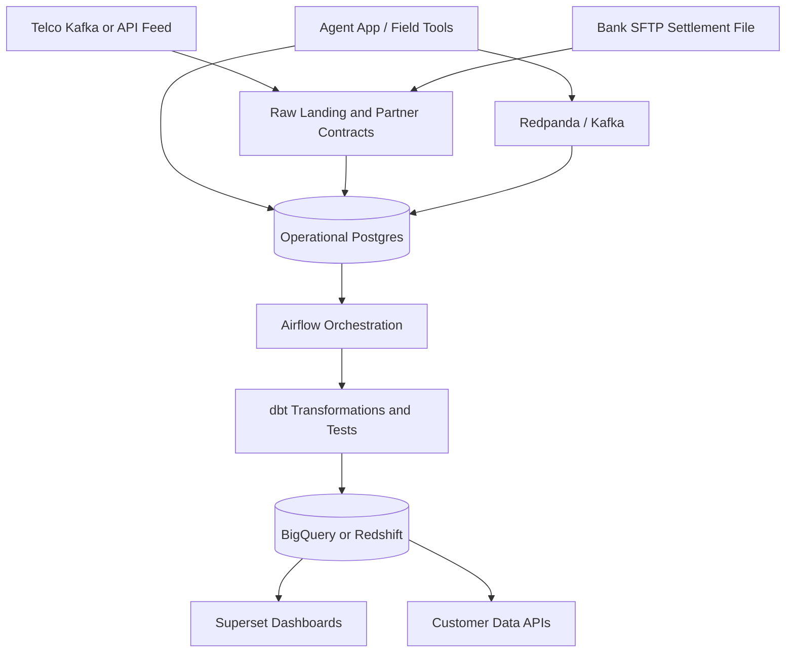

# Data Platform Roadmap

## Target Architecture

## Implemented Locally

- Operational API and database in FastAPI/Postgres.
- Redpanda-compatible event stream and worker.
- Partner contracts in `contracts/`.
- Contract-backed ingestion audit tables.
- Telco transaction ingestion service.
- Bank settlement ingestion service.
- Settlement mismatch detection through `reconciliation_exceptions`.
- PostgreSQL least-privilege, RLS, SCRAM, TLS configuration, and encrypted backup posture.
- dbt project with staging, intermediate, fact, dimension, and mart models.
- Airflow DAG scaffold for partner ingestion, settlement reconciliation, and dbt builds.
- Superset optional service configuration with dashboard/RLS guidance.

## dbt Models

The detailed SQL lineage is documented in [`sql-logic.md`](sql-logic.md), including the OLTP tables, dbt staging/intermediate/mart SQL, reconciliation SQL, and the `make e2e-sql-demo` command that prints real simulated records.

| Layer | Example model | Purpose |
| --- | --- | --- |
| Source | `src_postgres.yml` | Declare operational and partner source tables. |
| Staging | `stg_telco_transactions` | Rename, cast, and normalize raw partner transaction fields. |
| Staging | `stg_bank_settlements` | Normalize settlement files and enforce date/currency types. |
| Intermediate | `int_transactions_deduped` | Deduplicate by partner and provider reference. |
| Intermediate | `int_settlement_reconciliation` | Compare successful transaction totals to settlement totals through `settled_partner_id`. |
| Mart | `fact_transactions` | Trusted transaction fact for BI and downstream products. |
| Mart | `dim_agents` | Governed agent dimension with field-agent and country attributes. |
| Mart | `dim_partners` | Partner dimension for tenant-aware reporting. |
| Mart | `mart_partner_network_health` | Customer-facing dashboard dataset. |
| Mart | `mart_liquidity_risk` | Agent float risk and working-capital signal dataset. |

Implemented dbt tests:

- `not_null` on transaction IDs, agent IDs, provider references, settlement references, and dates.
- `unique` on partner/provider reference and partner/settlement reference.
- `accepted_values` for transaction status, transaction type, partner type, and currency.
- Relationship tests from raw transactions to agents and partners.
- Custom tests for negative amounts, commission greater than amount, and settlement mismatch tolerance.

## Airflow DAGs

| DAG | Schedule | Responsibilities | State |
| --- | --- | --- |
| `agent_network_partner_ingestion` | Daily | Calls API readiness, ingests sample telco transaction feed, ingests sample bank settlement, reconciles, and runs `dbt build`. | Implemented scaffold |
| `partner_telco_transactions` | Every 5 minutes | Pull/consume telco events, validate contract, load raw transactions, record run metadata. | Next |
| `partner_bank_settlements` | Daily | Detect settlement file, validate schema, load settlement summaries, alert on missing file. | Next |
| `data_quality_sla` | Every 15 minutes | Check freshness, failed runs, rejected record rate, and dashboard-readiness status. | Next |

## Superset Dashboard Plan

| Dashboard | Audience | Governed metrics |
| --- | --- | --- |
| Partner Network Health | Telco/bank partners | Active agents, transaction volume/value, failure rate, top regions, SLA freshness. |
| Reconciliation Exceptions | Data/ops teams | Missing files, mismatched counts, mismatched values, duplicate references. |
| Float Liquidity Risk | Operations and working-capital teams | Low-float agents, stockout risk, top-up frequency, repayment indicators. |
| Commission Performance | Commercial and partners | Commission earned, trend, agent ranking, region contribution. |
| Field Team Productivity | Internal managers | Visits, KYC completion, activation, issue resolution, region coverage. |

Superset should use partner-specific roles and row-level filters so external users only see records for their partner/country.

Superset is available through the optional `analytics` Compose profile and should be connected to the dbt mart schemas after `make dbt-build` succeeds.

## Cloud Deployment Path

GCP path:

- GCS for partner landing files.
- Cloud SQL for Postgres or AlloyDB where appropriate.
- BigQuery for warehouse marts.
- Cloud Run or GKE for API/worker.
- Cloud Composer for Airflow when managed orchestration is needed.

AWS path:

- S3 for partner landing files.
- RDS Postgres for operational persistence.
- Redshift Serverless for warehouse marts.
- ECS/Fargate for API/worker.
- MSK or Redpanda Cloud for Kafka-compatible streaming.
- MWAA for managed Airflow.

## On-Prem And Hybrid Pattern

For partners that cannot expose public APIs:

1. Partner exports CSV/Parquet or database view extracts on-prem.
2. Data moves through SFTP, VPN, private link, or a managed transfer job.
3. Files land in cloud storage or a restricted ingestion directory.
4. Ingestion validates against a versioned contract.
5. Raw data is stored immutably, then normalized into canonical tables.
6. Reconciliation checks compare partner totals to internal operational records.
7. Partner-facing dashboards expose only authorized, masked, and tested data.
