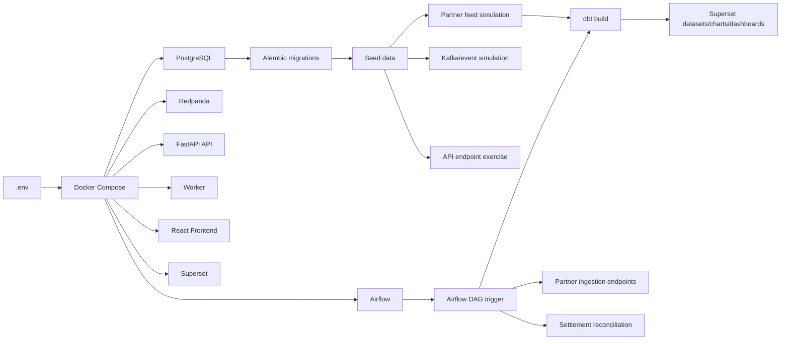

# Implementation Process

This document shows the implementation sequence, runtime dependencies, and verification flow for the local agent-network data platform.

## End-to-End Demo Command

Run the 15-minute local demo:

```bash
make demo-e2e
```

The command delegates to `scripts/run_end_to_end_demo.sh`. It runs for `900` seconds by default and can be shortened for quick checks:

```bash
DURATION_SECONDS=300 make demo-e2e
```

## Runtime Dependency Chain



## Gantt View

```mermaid
gantt
    title Local End-to-End Demo Implementation And Runtime
    dateFormat  X
    axisFormat  %M:%S

    section Bootstrap
    Load .env and compose config          :done, env, 0, 10s
    Start core containers                 :done, core, after env, 60s
    Start analytics/orchestration profiles:done, profiles, after core, 60s
    Wait for API readiness                :done, ready, after profiles, 30s

    section Database
    Run Alembic migrations                :done, migrate, after ready, 20s
    Seed deterministic demo data          :done, seed, after migrate, 20s

    section Reporting Setup
    Initial dbt build                     :done, dbt1, after seed, 45s
    Superset metadata initialization      :done, ss1, after dbt1, 45s
    Superset dashboard bootstrap          :done, ss2, after ss1, 20s
    Airflow admin and DAG bootstrap       :done, af1, after ss2, 20s

    section Fifteen Minute Live Run
    API endpoint exercise loop            :active, endpoints, after af1, 900s
    Kafka/event stream simulation         :active, stream, after af1, 900s
    Partner feed/dbt/Superset refresh loop:active, partner, after af1, 900s
    Airflow DAG triggers                  :active, airflowruns, after af1, 900s

    section Finalization
    Final dbt build                       :crit, finaldbt, after endpoints, 45s
    Final Superset asset refresh          :crit, finalss, after finaldbt, 20s
    Print service URLs and DAG status     :crit, urls, after finalss, 10s
```



## Dependency Details

| Dependency | Purpose | Local implementation |
| --- | --- | --- |
| Docker Compose | Starts and networks the full local stack | `docker-compose.yml` |
| PostgreSQL | OLTP store, integration audit store, analytics schemas | `postgres:16` |
| Alembic | Applies schema/security migrations | `backend/alembic/versions/` |
| Seed script | Creates deterministic users, agents, customers, partners, and contracts | `backend/app/scripts/seed.py` |
| Redpanda | Kafka-compatible event transport for domain events | `redpanda` service |
| Worker | Consumes/handles events and analytics snapshot work | `worker` service |
| FastAPI | Operational and integration API endpoints | `backend/app/routes/api.py` |
| Endpoint exerciser | Repeatedly calls frontend-facing API endpoints for the demo window | `backend/app/scripts/exercise_api_endpoints.py` |
| Stream simulator | Generates mixed transaction, float, KYC, and location events | `backend/app/scripts/simulate_stream.py` |
| Workflow simulator | Runs a randomized full cycle across transactions, float, KYC documents, partner feeds, settlements, reconciliation, MinIO, PostgreSQL, and Kafka | `backend/app/scripts/simulate_workflow_cycle.py` |
| Partner simulator | Generates telco transaction and bank settlement feeds | `backend/app/scripts/simulate_partner_e2e.py` |
| dbt | Builds staging, intermediate, fact, dimension, and mart models | `dbt/` |
| Airflow | Orchestrates partner ingestion, reconciliation, and dbt build | `airflow/dags/agent_network_data_platform.py` |
| Superset | Provides governed BI datasets, charts, and dashboards | `superset/bootstrap_assets.py` |

## Observable Outputs

During the run, watch these surfaces:

| Surface | URL | What changes during the demo |
| --- | --- | --- |
| Frontend | `http://127.0.0.1:5173` | Agent, transaction, float, KYC, map, event, and report data refreshes |
| API docs | `http://127.0.0.1:8000/docs` | All operational and integration endpoints are available for manual inspection |
| Redpanda Console | `http://127.0.0.1:18081` | Domain topics receive transaction, float, KYC, location, and commission events |
| Airflow | `http://127.0.0.1:18080` | `agent_network_partner_ingestion` DAG runs are triggered |
| Superset | `http://127.0.0.1:18088` | Partner network, liquidity risk, and reconciliation dashboards refresh after dbt builds |

## Implementation State

The current implementation demonstrates:

- OLTP workflows for auth, agents, customers, KYC review, float requests, transactions, commissions, reports, maps, and event audit.
- Kafka-compatible event publication through Redpanda.
- Partner/telco/bank contract-backed ingestion.
- Reconciliation exception creation for mismatched settlement feeds.
- dbt transformations into governed analytics schemas.
- Airflow orchestration of ingestion, reconciliation, and dbt.
- Superset bootstrap for local BI datasets, charts, and dashboards.
- Database security controls documented in `docs/database-security.md`.

Production hardening still expected outside the local demo:

- Managed Airflow metadata database instead of local SQLite.
- Production Superset secret management, Redis-backed rate limiting, and role provisioning.
- Cloud warehouse targets such as BigQuery or Redshift.
- Provider-level pgAudit, firewall/private networking, and encryption-at-rest enforcement.
