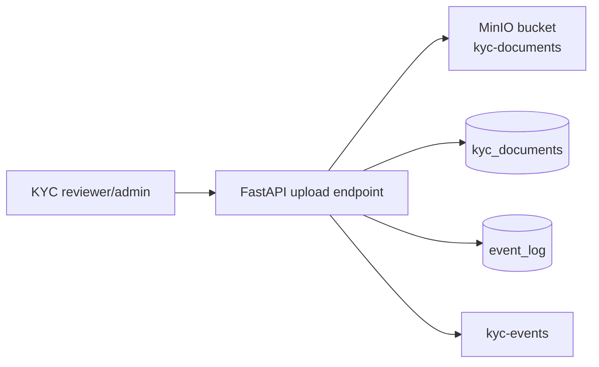

# KYC Document Storage

The current implementation stores KYC document **metadata** in PostgreSQL and stores file bytes in MinIO object storage. A local filesystem adapter remains available for tests and explicit fallback development.

## Current Local Flow



Endpoints:

- `POST /api/v1/kyc/customers/{customer_id}/documents`
- `GET /api/v1/kyc/customers/{customer_id}/documents`

Allowed upload types:

- `image/jpeg`
- `image/png`
- `application/pdf`

Allowed document categories:

- `customer_photo`
- `national_id_front`
- `national_id_back`
- `proof_of_address`
- `other`

## PostgreSQL Metadata

`kyc_documents` stores:

- customer relationship
- document type
- original filename
- storage backend and storage key
- SHA-256 hash
- MIME type and file size
- uploader user ID
- verification status
- review notes and timestamps

The table is covered by forced RLS and role grants. File bytes are not stored in PostgreSQL.

## PostgreSQL To MinIO Linkage

Every KYC object has two records:

- the file bytes in MinIO
- the searchable metadata row in PostgreSQL `kyc_documents`

The join is deterministic:

| PostgreSQL field | MinIO field | Purpose |
| --- | --- | --- |
| `kyc_documents.storage_backend` | storage implementation | Confirms whether the object is in `minio` or local filesystem fallback. |
| `kyc_documents.storage_key` | MinIO object key/path | Primary lookup from Postgres metadata to the object bytes. |
| `kyc_documents.sha256_hash` | `X-Amz-Meta-Sha256` | Integrity check that the object matches the stored metadata. |
| `kyc_documents.customer_id` | `X-Amz-Meta-Customer_id` | Customer relationship check. Also links to `customers.id`. |
| `kyc_documents.mime_type` | MinIO object `Content-Type` | File type validation and review workflow routing. |
| `kyc_documents.file_size_bytes` | MinIO object size | Basic completeness check. |

The MinIO object key is generated as:

```text
{customer_id}/{sha256_hash_prefix_16}-{safe_original_filename_stem}.{extension}
```

Example:

```text
Postgres storage_key:
cust_hamadi/02b29de4c84123f8-national_id_back_20260605212245_1099.pdf

MinIO object:
bucket=kyc-documents
key=cust_hamadi/02b29de4c84123f8-national_id_back_20260605212245_1099.pdf

Postgres sha256_hash:
02b29de4c84123f8eca42fb525f4f3874706c9d...

MinIO metadata:
X-Amz-Meta-Sha256=02b29de4c84123f8eca42fb525f4f3874706c9d...
X-Amz-Meta-Customer_id=cust_hamadi
Content-Type=application/pdf
```

## Reproducibility Checks

Find the PostgreSQL row for a MinIO object hash:

```bash
docker compose exec -T postgres psql -U agent_owner -d agent_network -c "
select
  id,
  customer_id,
  document_type,
  original_filename,
  storage_backend,
  storage_key,
  sha256_hash,
  mime_type,
  file_size_bytes,
  verification_status,
  created_at
from kyc_documents
where sha256_hash like '02b29de4c84123f8%';
"
```

List recent KYC metadata rows:

```bash
docker compose exec -T postgres psql -U agent_owner -d agent_network -c "
select
  id,
  customer_id,
  document_type,
  storage_backend,
  storage_key,
  left(sha256_hash, 16) as sha256_prefix,
  mime_type,
  file_size_bytes,
  created_at
from kyc_documents
order by created_at desc
limit 10;
"
```

Verify the object exists in MinIO using the object key from PostgreSQL:

```bash
docker run --rm --network agent-network-infra-sim_default --entrypoint sh \
  -e MINIO_ROOT_USER="${MINIO_ROOT_USER:-agentminio}" \
  -e MINIO_ROOT_PASSWORD="${MINIO_ROOT_PASSWORD:-local-agent-minio-password}" \
  minio/mc:RELEASE.2025-04-16T18-13-26Z \
  -c 'mc alias set local http://minio:9000 "$MINIO_ROOT_USER" "$MINIO_ROOT_PASSWORD" &&
  mc stat local/kyc-documents/cust_hamadi/02b29de4c84123f8-national_id_back_20260605212245_1099.pdf'
```

If the object is present, `mc stat` should show the object key, content type,
size, and user metadata such as `sha256` and `customer_id`.

Open the MinIO console:

```text
http://127.0.0.1:9001
```

Use the credentials from `.env`:

```text
MINIO_ROOT_USER
MINIO_ROOT_PASSWORD
```

Local defaults are:

```text
agentminio
local-agent-minio-password
```

Then browse:

```text
kyc-documents/{customer_id}/{sha256_prefix}-{filename}
```

## Traceability Rules

For a KYC document to be considered traceable:

1. `kyc_documents.customer_id` must reference an existing `customers.id`.
2. `kyc_documents.storage_backend` must identify the active storage adapter.
3. `kyc_documents.storage_key` must resolve to an object in MinIO or local fallback storage.
4. `kyc_documents.sha256_hash` must match the object hash metadata and, in production, a recalculated object hash.
5. `kyc_documents.mime_type` must match the object `Content-Type`.
6. `kyc_documents.file_size_bytes` must match the object size.
7. A `customer.kyc_submitted` event should exist in `event_log` with the same `document_id`, `customer_id`, and `sha256_hash`.

Event log check:

```bash
docker compose exec -T postgres psql -U agent_owner -d agent_network -c "
select
  id,
  name,
  customer_id,
  payload ->> 'document_id' as document_id,
  payload ->> 'sha256_hash' as sha256_hash,
  created_at
from event_log
where name = 'customer.kyc_submitted'
order by created_at desc
limit 10;
"
```

## Local MinIO

Docker Compose starts:

- `minio` at `http://127.0.0.1:9000`
- MinIO Console at `http://127.0.0.1:9001`
- `minio-init`, which creates the private `kyc-documents` bucket

The API uses these environment variables:

```bash
KYC_STORAGE_BACKEND=minio
MINIO_ENDPOINT=minio:9000
MINIO_ACCESS_KEY=agentminio
MINIO_SECRET_KEY=...
MINIO_BUCKET=kyc-documents
MINIO_SECURE=false
```

For tests or filesystem-only development, set:

```bash
KYC_STORAGE_BACKEND=local
KYC_STORAGE_PATH=storage/kyc
```

## Why Not Store Images In PostgreSQL?

PostgreSQL is the right place for searchable metadata, audit relationships, constraints, and review status. It is usually the wrong place for growing binary object storage because images increase backup size, slow restores, and make lifecycle/retention management harder.

## Production Swap

The MinIO adapter is the local object-storage implementation. In hosted production, the same storage boundary should be backed by the cloud provider object store:

| Environment | Storage backend |
| --- | --- |
| Local development | MinIO bucket `kyc-documents`; optional `storage/kyc` fallback |
| AWS | S3 with SSE-KMS and presigned URLs |
| Azure | Blob Storage with private containers and SAS URLs |
| GCP | Cloud Storage with signed URLs |
| Self-hosted/local object storage | MinIO |

Production requirements:

- private bucket/container
- encryption at rest
- short-lived signed URLs for file access
- malware/content scanning before review
- file hash verification
- audit events for upload, view, approval, rejection, and deletion
- retention policy tied to KYC/data-protection obligations
