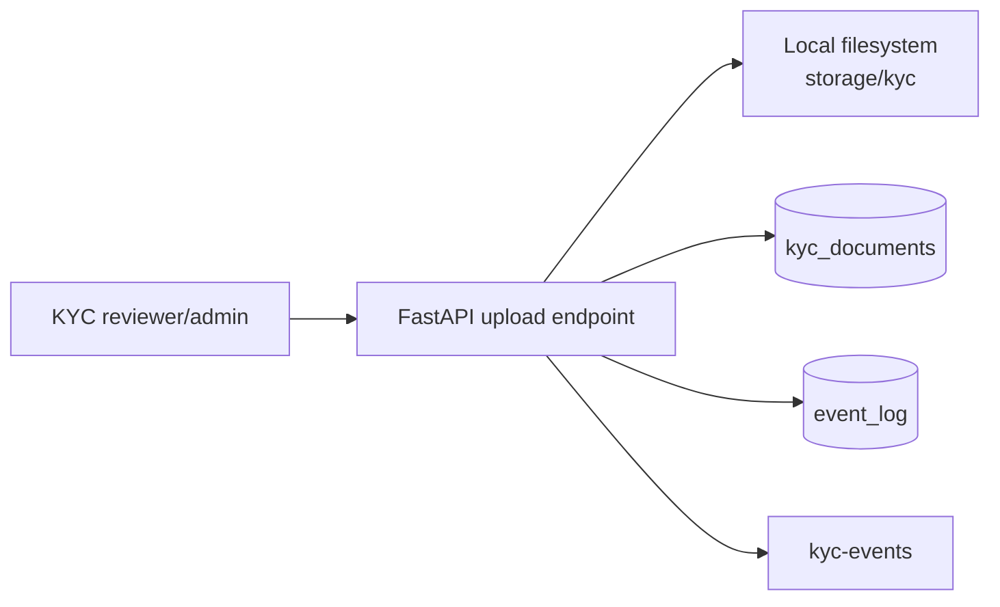

# KYC Document Storage

The current implementation stores KYC document **metadata** in PostgreSQL and stores file bytes through a local development storage adapter.

## Current Local Flow

Endpoints:

- `POST /api/v1/kyc/customers/{customer_id}/documents`
- `GET /api/v1/kyc/customers/{customer_id}/documents`

Allowed upload types:

- `image/jpeg`
- `image/png`
- `application/pdf`

Allowed document categories:

- `customer_photo`
- `national_id_front`
- `national_id_back`
- `proof_of_address`
- `other`

## PostgreSQL Metadata

`kyc_documents` stores:

- customer relationship
- document type
- original filename
- storage backend and storage key
- SHA-256 hash
- MIME type and file size
- uploader user ID
- verification status
- review notes and timestamps

The table is covered by forced RLS and role grants. File bytes are not stored in PostgreSQL.

## Why Not Store Images In PostgreSQL?

PostgreSQL is the right place for searchable metadata, audit relationships, constraints, and review status. It is usually the wrong place for growing binary object storage because images increase backup size, slow restores, and make lifecycle/retention management harder.

## Production Swap

The local adapter should be replaced with object storage in production:

| Environment | Storage backend |
| --- | --- |
| Local development | `storage/kyc` filesystem path |
| AWS | S3 with SSE-KMS and presigned URLs |
| Azure | Blob Storage with private containers and SAS URLs |
| GCP | Cloud Storage with signed URLs |
| Self-hosted/local object storage | MinIO |

Production requirements:

- private bucket/container
- encryption at rest
- short-lived signed URLs for file access
- malware/content scanning before review
- file hash verification
- audit events for upload, view, approval, rejection, and deletion
- retention policy tied to KYC/data-protection obligations
