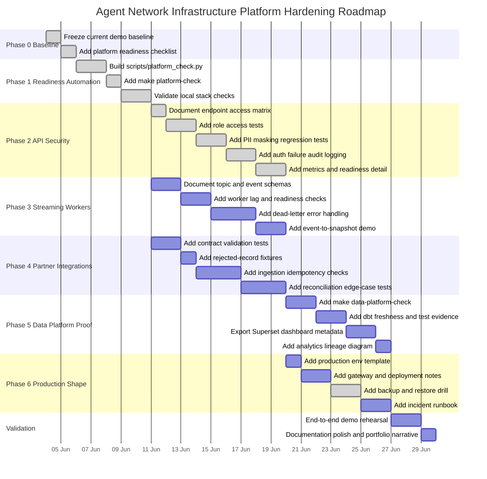
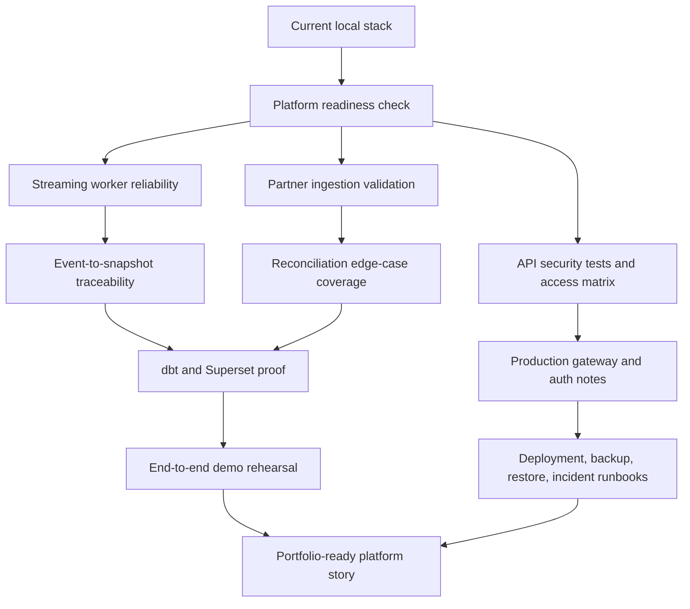

# Platform Implementation Gantt

This roadmap turns the current local agent-network simulation into a stronger, production-shaped portfolio project without jumping too quickly into expensive infrastructure. The path of least resistance is to harden what already exists locally, prove it with automated checks, then add production patterns only where the project has a clear gap.

## Implementation Strategy

The implementation should proceed in this order:

1. Prove the current stack is healthy with one repeatable readiness command.
2. Lock down the API surface with role-based tests, audit logging, and documented access rules.
3. Strengthen streaming and worker reliability so events can be traced from Kafka to analytical snapshots.
4. Harden partner ingestion and reconciliation with contract validation, idempotency, and failure examples.
5. Prove the analytics layer with dbt tests, Superset metadata, and clear lineage.
6. Add production-readiness documentation for gateway, deployment, backup, restore, and incident response.

This avoids high-cost production tooling before the core platform behavior is demonstrably correct.

## Non-Functional Priorities

Every implementation phase should be judged against five platform qualities:

| Priority | What It Means Here | Implementation Gate |
| --- | --- | --- |
| Security | API, database, Kafka, partner feeds, dashboards, and admin actions must enforce least privilege and avoid exposing sensitive operational or customer data. | No new endpoint, ingestion path, worker, dashboard, or admin operation is complete until authentication, authorization, PII handling, audit logging, and failure behavior are tested. |
| Availability | The system should keep core operational paths usable when optional components fail. | API health/readiness must distinguish database, Kafka, worker, Airflow, Superset, and dbt status so failures are isolated instead of hidden. |
| Scalability | The design should show how load grows across users, records, events, integrations, and analytics workloads. | New flows must identify whether they scale vertically, horizontally, asynchronously, through caching, or through partitioning. |
| Reliability | Events, ingestions, reconciliations, and analytics snapshots must be repeatable, traceable, and recoverable. | New integrations must include idempotency, retries, rejected-record handling, dead-letter handling where relevant, and replay notes. |
| Integrations | External systems should connect through documented contracts and stable boundaries. | Partner feeds, APIs, webhooks, and analytics exports must have schemas, validation examples, versioning, and clear ownership. |

The guiding system-design themes are:

- APIs should expose stable, documented resources with predictable request and response behavior.
- API gateway or reverse-proxy concerns should be separated from application logic: TLS termination, rate limiting, routing, request size limits, and central access logging belong at the edge.
- JWT/OIDC should remain stateless for API calls, but token validation, expiry, role mapping, and audit logging must be explicit.
- Webhooks and partner feeds should acknowledge quickly, persist raw receipt metadata, then process asynchronously through queues or workers.
- Single points of failure should be called out directly, especially PostgreSQL, Redpanda, the worker process, the API container, and local-only dashboards.
- CAP trade-offs should be documented per workflow. Financial and reconciliation paths should prefer consistency; dashboards and monitoring summaries can tolerate eventual consistency when clearly labelled.
- Rate limiting should protect public or partner-facing endpoints, especially login, ingestion, webhook, search, and export routes.

Reference material considered for this roadmap includes public system-design notes on APIs, API gateways, avoiding single points of failure, CAP theorem, scalability, JWTs, proxies, webhooks, and rate limiting:

- <https://blog.algomaster.io/p/whats-an-api>
- <https://blog.algomaster.io/p/what-is-an-api-gateway>
- <https://blog.algomaster.io/p/system-design-how-to-avoid-single-point-of-failures>
- <https://blog.algomaster.io/p/cap-theorem-explained>
- <https://blog.algomaster.io/p/scalability>
- <https://blog.algomaster.io/p/json-web-tokens>
- <https://blog.algomaster.io/p/proxy-vs-reverse-proxy-explained>
- <https://blog.algomaster.io/p/what-are-webhooks>
- <https://blog.algomaster.io/p/rate-limiting-algorithms-explained-with-code>

## Gantt Chart

## Dependency View

## Workstream Details

| Phase | Outcome | Main Deliverables | Depends On |
| --- | --- | --- | --- |
| 0. Baseline | Current repo behavior is known and stable. | Baseline checklist and current capability inventory. | Existing repo. |
| 1. Readiness Automation | One command confirms the local platform is usable. | `scripts/platform_check.py`, `make platform-check`, local readiness evidence. | Phase 0. |
| 2. API Security | Endpoint exposure is explicit and testable. | Access matrix, role tests, PII masking tests, audit logging, health/readiness detail. | Phase 1. |
| 3. Streaming Workers | Event flow is traceable and failure-aware. | Topic schemas, consumer lag checks, dead-letter handling, event-to-snapshot demo. | Phase 1. |
| 4. Partner Integrations | External feeds behave like real controlled integrations. | Contract tests, rejected fixtures, idempotency checks, reconciliation edge cases. | Phase 1. |
| 5. Data Platform Proof | OLTP-to-analytics value is visible and governed. | dbt checks, Superset metadata, analytics lineage, mart evidence. | Phases 3 and 4. |
| 6. Production Shape | The repo shows credible production thinking. | Production env template, gateway notes, backup/restore drill, incident runbook. | Phase 2. |

## Lowest-Headwind Starting Point

The first implementation step was `scripts/platform_check.py` plus `make platform-check`.

That gives immediate value because it does not require new cloud accounts, paid services, or architecture changes. It also creates a foundation for every later phase: API security, Kafka reliability, partner ingestion, dbt, Superset, and deployment readiness can all plug into the same verification command.

The API security phase now includes an endpoint access matrix, executable role-boundary tests, PII masking regression tests, security audit logging, and richer readiness detail. The SPOF slice adds a reliability register plus encrypted backup restore validation. The next dependency phase is streaming-worker reliability.

## Acceptance Criteria

Before moving to full-scale implementation, the roadmap should be considered ready when:

- A new contributor can understand the implementation sequence from this document alone.
- Each major workstream has a visible dependency path.
- The first implementation step is small enough to finish locally.
- Later production work is framed as a hardening path, not a rewrite.
- The final demo story connects API, database, streaming, partner feeds, analytics, security, and operations.
