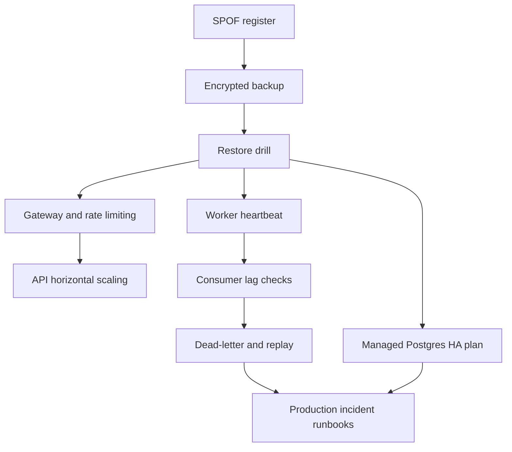

# Single Point of Failure Analysis

This analysis maps single points of failure to the current local stack and the production-shaped target architecture. The local Docker Compose setup is intentionally single-node; the purpose of this document is to make that explicit and show the mitigation path.

## SPOF Register

| Component | Current SPOF | Failure Impact | Current Control | Required Production Control | Priority |
| --- | --- | --- | --- | --- | --- |
| PostgreSQL | One `postgres` container and one `postgres-data` volume. | Auth, API writes, audit logs, partner ingestion, reconciliation, and dbt sources stop. | Healthcheck, RLS, SCRAM, encrypted backup script. | Managed PostgreSQL HA, automated backups, PITR, restore drill, private networking, disk monitoring. | P0 |
| API | One FastAPI container on port `8000`. | Frontend, partner ingestion, auth, audit endpoint, and reporting APIs unavailable. | `/health`, `/ready`, API tests, `make platform-check`. | Multiple API replicas behind gateway/load balancer, stateless app runtime, rate limits, request timeouts. | P0 |
| Redpanda/Kafka | One Redpanda broker and one `redpanda-data` volume. | Event stream and worker processing stop; analytics freshness degrades. | Local broker check, broker data volume, and persisted `event_log`. | Broker cluster or managed Kafka, replicated topics, consumer lag alerts, replay from persisted event log. | P1 |
| Worker | One worker process. | Analytics snapshots and event-derived jobs stop updating. | `worker_errors` table. | Worker heartbeat, readiness check, restart policy, idempotent processing, scalable consumer group. | P1 |
| Docker host | All services run on one developer machine. | Total local outage. | Local simulation only. | Separate runtime nodes or managed container platform. | P1 |
| Backup storage | Encrypted backups are local files unless moved. | Host loss can remove both database and backups. | AES-256 encrypted dump. | Off-host/object storage, retention policy, restore validation, RPO/RTO targets. | P0 |
| Secrets | `.env` stores local secrets. | Secret leak affects database and JWT security. | `.env.example` only committed. | Secret manager, rotation, OIDC/JWKS, no static production JWT secret in files. | P1 |
| Frontend | One Vite dev container. | UI unavailable, although API may still work. | Local dev server. | Static asset hosting/CDN or replicated frontend service. | P2 |
| Airflow | Single standalone Airflow container with SQLite metadata in `airflow-metadata` and task logs in `airflow-logs`. | Scheduled ingestion/dbt orchestration unavailable. | Default Compose service, persisted local metadata/log volumes, and manual commands. | Managed Airflow or HA executor with external metadata DB and durable remote logs. | P2 |
| Superset | Single Superset container with local metadata volume. | BI dashboards unavailable. | Default Compose service and bootstrap scripts. | External metadata DB, exported dashboard assets, HA deployment, backups. | P2 |

## Highest-Risk Failure Modes

### PostgreSQL

PostgreSQL is the highest-impact SPOF because it is the operational system of record. Database loss affects identity, operational transactions, audit history, partner ingestion, and analytics source data.

Immediate mitigations in this repo:

- `make backup` creates encrypted logical backups.
- `make restore-drill` restores an encrypted backup into a temporary database, checks core tables, and drops the temporary database afterward.

Production target:

- managed PostgreSQL with HA failover
- point-in-time recovery
- daily restore validation
- private networking
- storage, lock, replication, and connection saturation alerts

### API

The API is stateless enough to scale horizontally, but the local Compose stack runs a single instance. It currently has health and readiness endpoints, but no gateway or load balancer.

Required next steps:

- add a gateway/reverse-proxy layer
- run at least two API replicas in production
- terminate TLS at the gateway
- enforce rate limits and request size limits at the edge

### Redpanda/Kafka

The local broker provides Kafka-compatible semantics and now persists broker data
to `redpanda-data`, but it still has no replication. The persisted PostgreSQL
`event_log` lowers the blast radius because business events can be replayed
later if a replay tool is added.

Required next steps:

- document topic schemas
- add dead-letter handling
- add consumer lag visibility
- add event replay from `event_log`
- use clustered or managed Kafka in production

### Worker

The worker is not on the critical request path, but it is critical for analytics freshness. A silent worker failure is dangerous because the API can remain healthy while dashboards become stale.

Required next steps:

- add worker heartbeat
- add worker freshness to `/ready`
- add idempotent snapshot writes
- extend beyond the local `restart: unless-stopped` policy with production worker health probes and autoscaling

## CAP Trade-Offs

| Workflow | Preferred CAP posture | Reason |
| --- | --- | --- |
| Login and role checks | Consistency over availability | Access control must not accept stale or ambiguous identity state. |
| Transaction posting | Consistency over availability | Financial records should not split-brain or double-post. |
| Partner settlement reconciliation | Consistency over availability | Exact matching and exception queues need authoritative state. |
| Event stream processing | Availability with replay | Events can be persisted and replayed if Kafka or workers fail. |
| Dashboards and Superset reports | Eventual consistency | Reporting can tolerate freshness labels and delayed refresh. |

## Mitigation Roadmap

## Current Acceptance Gates

Before calling the local platform healthy:

- `make platform-check` must pass.
- Alembic must be at head.
- `make backup` must produce an encrypted backup.
- `make restore-drill` must restore that backup into a temporary database and verify core tables.

Before calling a production design credible:

- PostgreSQL has HA, PITR, and restore testing.
- API has a gateway and at least two runtime instances.
- Kafka has replication or managed equivalent.
- Worker freshness and consumer lag are monitored.
- Backups are stored off-host with retention.
- Airflow/Superset metadata stores and Airflow task logs are backed up or managed.
