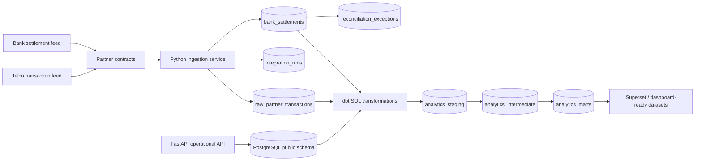

# SQL Logic And End-To-End Data Lineage

This project uses SQL in two places:

- OLTP SQL generated by SQLAlchemy against the operational PostgreSQL tables.
- Analytical SQL written explicitly in dbt models under `dbt/models`.

The SQL design shows how a realistic agent-network record moves from operational intake into governed reporting marts.

## End-To-End Flow



## OLTP Tables

The operational schema receives real simulated entries from the API and ingestion services:

| Table | Inserted by | Role in workflow |
| --- | --- | --- |
| `transactions` | `/api/v1/transactions` and stream simulator | Operational mobile-money transaction records. |
| `float_requests` | `/api/v1/float/requests` and stream simulator | Agent float/cash request workflow. |
| `event_log` | `EventPublisher.publish()` | Durable audit copy of every domain event before or alongside Kafka publishing. |
| `integration_runs` | Partner ingestion service | One row per partner feed/file/API batch received. |
| `raw_partner_transactions` | Telco feed ingestion | Canonical partner transaction records with hashed customer identifiers. |
| `bank_settlements` | Bank settlement ingestion | Bank-owned settlement totals with `settled_partner_id` pointing to the partner whose transactions are being settled. |
| `reconciliation_exceptions` | Reconciliation service | Exception queue when settlement totals do not match raw transactions. |

## dbt SQL Layers

### Sources

`dbt/models/sources.yml` declares the operational tables used by dbt:

```yaml
sources:
  - name: app
    schema: public
    tables:
      - name: agents
      - name: field_agents
      - name: partners
      - name: raw_partner_transactions
      - name: bank_settlements
```

### Staging

Staging SQL renames and normalizes operational tables.

Example: `dbt/models/staging/stg_telco_transactions.sql`

```sql
select
    id as raw_transaction_id,
    partner_id,
    integration_run_id,
    provider_reference,
    agent_id,
    customer_msisdn_hash,
    upper(transaction_type) as transaction_type,
    amount,
    commission,
    upper(status) as transaction_status,
    transaction_created_at,
    loaded_at
from {{ source('app', 'raw_partner_transactions') }}
```

Purpose:

- preserves the raw transaction identifier
- normalizes status and transaction type to uppercase
- keeps hashed customer identifier only, not raw MSISDN
- prepares the data for deduplication and mart joins

### Intermediate

Intermediate SQL implements business rules that should not live directly in final dashboards.

Example: `dbt/models/intermediate/int_transactions_deduped.sql`

```sql
with ranked as (
    select
        *,
        row_number() over (
            partition by partner_id, provider_reference
            order by loaded_at desc, raw_transaction_id desc
        ) as row_num
    from {{ ref('stg_telco_transactions') }}
)

select ...
from ranked
where row_num = 1
```

Purpose:

- handles duplicate provider references
- keeps the latest loaded version
- prevents duplicate partner records from inflating dashboards

Example: `dbt/models/intermediate/int_settlement_reconciliation.sql`

```sql
with transaction_totals as (
    select
        partner_id,
        count(*) as raw_transaction_count,
        coalesce(sum(amount), 0) as raw_gross_amount,
        coalesce(sum(commission), 0) as raw_commission_amount
    from {{ ref('int_transactions_deduped') }}
    where transaction_status = 'SUCCESS'
    group by partner_id
)

select
    settlements.settlement_id,
    settlements.partner_id,
    settlements.settled_partner_id,
    case
        when settlements.transaction_count = coalesce(transaction_totals.raw_transaction_count, 0)
         and settlements.gross_amount = coalesce(transaction_totals.raw_gross_amount, 0)
            then 'matched'
        else 'exception'
    end as reconciliation_status
from {{ ref('stg_bank_settlements') }} as settlements
left join transaction_totals
    on settlements.settled_partner_id = transaction_totals.partner_id
```

Purpose:

- compares bank settlement totals against successful transactions for the explicit settled partner
- classifies each settlement as `matched` or `exception`
- gives operations a defensible reconciliation signal

### Marts

Marts are dashboard-ready datasets.

| Mart | SQL purpose | Dashboard use |
| --- | --- | --- |
| `fact_transactions` | Trusted deduplicated transaction fact. | Transaction volume, value, status, commission. |
| `dim_agents` | Agent and field-agent attributes. | Regional/agent filtering and joins. |
| `dim_partners` | Partner metadata. | Partner/country filtering and row-level security. |
| `mart_partner_network_health` | Aggregates transaction volume, value, commission, active agents, failed transactions. | Executive and partner health dashboard. |
| `mart_liquidity_risk` | Combines agent float/cash balances with recent transaction activity. | Operations liquidity dashboard. |

## Real Simulated Demo

Run the end-to-end SQL lineage demo:

```bash
make e2e-sql-demo
```

The command:

1. Runs Alembic migrations.
2. Loads a unique simulated telco transaction feed.
3. Loads a unique simulated bank settlement feed.
4. Runs settlement reconciliation.
5. Builds dbt models.
6. Prints real records and counts from OLTP and analytics marts.

The output shows concrete rows from:

- `integration_runs`
- `raw_partner_transactions`
- `bank_settlements`
- `reconciliation_exceptions`
- `analytics_marts.fact_transactions`
- `analytics_marts.mart_partner_network_health`
- `analytics_marts.mart_liquidity_risk`

## Data Quality Tests

dbt tests in `dbt/models/schema.yml` enforce:

- unique transaction keys
- non-null mart keys
- accepted transaction status and type values
- partner and agent relationship integrity
- settlement reconciliation status values

These tests are part of the analytical reliability story: SQL does not only transform data; it also proves that dashboard tables remain valid.
