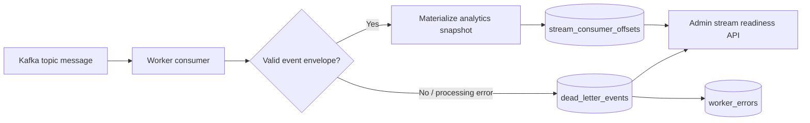

# Streaming Reliability

This slice turns the event stream from a best-effort local demo into an auditable worker path.

## Topic Map

| Domain event | Kafka topic | Producer | Consumer purpose |
| --- | --- | --- | --- |
| `float.requested`, `float.approved`, `float.rejected`, `float.disbursed` | `float-events` | Float API/service | Liquidity tracking and snapshot refresh. |
| `transaction.created` | `transaction-events` | Transaction service | Transaction reporting and liquidity updates. |
| `commission.calculated` | `commission-events` | Transaction service | Commission reporting and reconciliation monitoring. |
| `customer.kyc_submitted`, `customer.kyc_reviewed` | `kyc-events` | KYC API/service | Compliance monitoring and customer-status reporting. |
| `agent.location_updated` | `agent-location-events` | Stream simulator/API | Field-team movement and map freshness. |

## Event Envelope

Events persisted to `event_log` and published to Kafka use this envelope:

```json
{
  "id": "event uuid",
  "name": "transaction.created",
  "payload": {
    "aggregate_type": "transaction",
    "aggregate_id": "tx_123",
    "agent_id": "agent_neema"
  },
  "created_at": "2026-06-05T06:33:50+00:00"
}
```

The payload is masked before persistence/publication, so worker logs and dead-letter records should not contain raw customer phone numbers, national IDs, passwords, JWTs, or authorization headers.

## Worker Reliability Tables

| Table | Purpose | Operational use |
| --- | --- | --- |
| `stream_consumer_offsets` | One row per consumer group, topic, and partition. Tracks last processed offset, last event ID, processed count, failed count, and last update time. | Shows whether the worker is moving, stuck, or repeatedly failing. |
| `dead_letter_events` | Stores failed worker messages with topic, partition, offset, event ID/name where available, failure reason, and status. | Gives operations a queue for replay, triage, and incident investigation. |
| `worker_errors` | Legacy worker error log retained for compatibility. Now includes the related dead-letter ID in payload when available. | Backward-compatible error audit trail. |

## Admin Endpoints

| Endpoint | Role | Use |
| --- | --- | --- |
| `GET /api/v1/stream/readiness` | `admin` | Summarizes tracked partitions, processed messages, failures, open dead letters, and worker errors. |
| `GET /api/v1/stream/dead-letter-events` | `admin` | Lists dead-letter records for triage. |

Readiness returns `ok` when there are no tracked failures or open dead letters. It returns `degraded` when open dead letters, failed counts, or worker errors exist.

## Failure Workflow



## Production Notes

- Consumer offsets are application-level readiness evidence; Kafka remains the authoritative broker offset store.
- Dead-letter records should be replayed through a controlled admin workflow, not manually edited in production.
- For high-volume production traffic, add partition-aware lag checks using Kafka group offsets and broker high-water marks.
- Financial settlement and reconciliation events should favor consistency and replayability over low-latency dashboard updates.
